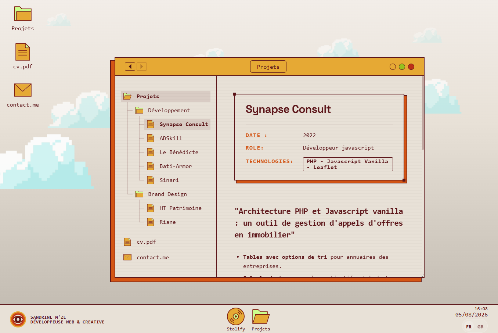

[🇫🇷 Français](README.md) | 🇬🇧 English

---

Portfolio2026 is a portfolio web application built with React and Strapi.



**Main architecture**

* Frontend: React 18 application with Redux for state management
* Backend: Strapi CMS for content management
* Build: Webpack with TypeScript and Sass

**Key technologies**

* React 18.2.0, Redux, React Router
* Strapi (headless CMS backend)
* Sass for styling
* Axios for API requests
* Custom audio player (Stolify)

**Structure**
* Frontend (`src/`): Components, containers, Redux store
* Backend (`strapi/`): Strapi API for project management

**Features**
* Desktop-like UI with an icon grid (IconGrid) to navigate projects and folders
* Folder and project navigation system
* Multimedia support (audio player)
* FR/EN language switching

**Getting started**

```bash
# Run both services together (recommended)
yarn start:all

# Or separately:
# Frontend: yarn start  (root)       → localhost:3000
# Backend:  yarn start:strapi (strapi/) → localhost:1337
```

**Code formatting**

The project uses [Prettier](https://prettier.io/) for consistent code style (`.tsx`, `.ts`, `.scss`).

```bash
# Format all files
npm run format

# Check formatting without modifying files (e.g. in CI)
npm run format:check
```

An interactive portfolio with a modern full-stack architecture.

---

# Components — Portfolio2026

The application simulates a **desktop operating system** (macOS/Windows style) with draggable windows, a virtual file explorer powered by Strapi, and two embedded mini-applications (Stolify, ArtQuiz).

---

## Global architecture

| Layer | Technology |
|---|---|
| Global state | Redux (`state.main`) |
| FR/EN translation | `LanguageContext` + `useTranslation()` |
| Window animations | GSAP + DOM CustomEvents |
| Quiz | `QuizContext` (local useReducer) |
| Project data | Strapi API (fetched on mount) |

---

## Application entry point

### `Main`
Entry point. Triggers the Strapi project fetch, shows `LoadingScreen` while loading, then renders `Desktop` + `DesktopBottomBar`.

- **Redux**: dispatches `fetchProjects()`, reads `fileSystem`, `loading`
- **Local state**: `showLoader` — controls loader visibility

---

## Desktop

### `Desktop`
Main surface. Renders clickable icons (Projects, CV, Contact), background clouds, and orchestrates **all GSAP window animations** via a persistent `div.fantom`.

- **DOM CustomEvents listened**: `window-minimize`, `window-restore`, `window-close`
- **Redux**: reads `windowItemId`, `windowPositions`, `openWindows`; dispatches `minimizeWindow`, `openWindow`, `closeWindow`
- **Music theming**: listens to `stolify-play` / `stolify-stop` to apply `desktop--track-N` class (background and cloud color filter changes based on the current Stolify track)
- Renders `<Item>` × 3 + `<Window>`

### `MobileScreen`
Fallback screen shown below 900px. Displays identity (logo, name, title), an apology message, and a Notion CV iframe. No Redux.

### `DesktopBottomBar`
Fixed left sidebar. Shows the logo, the Stolify button, `TaskBar`, live time/date, and the language switcher.

- **Redux**: reads `openWindows`, `minimizedWindows`; dispatches `openWindow`, `closeWindow`
- **Local state**: `today: Date`, updated every 60 seconds

### `TaskBar`
Lists open windows (excluding Stolify/ArtQuiz). Click → restore or focus.

- If minimized: dispatches CustomEvent `window-restore` (caught by Desktop/GSAP)
- Otherwise: dispatches `openWindow`
- Each item has `data-taskbar-id` (targeted by GSAP)
- Uses `ScrambleText` for labels

---

## Windows

### `Window`
Manager for the 5 draggable windows: `projets`, `resume`, `contact_me`, `stolify`, `artquiz`. Handles z-index, cascaded positioning, resize, and visibility based on Redux state.

- **Redux**: reads `windowItemId`, `isOpen`, `fileSystem`, `view`, `currentPath`, `minimizedWindows`, `openWindows`; dispatches `openFolder`. Also uses `useSelector` directly for `getCurrentNode` and `getProjectById`
- **Local state**: `zIndexes` (stacking order), `forceRerender`
- Uses `react-draggable` with `handle=".window-header-container"`
- Each window has `data-window-id` (targeted by GSAP in Desktop)
- Depending on the active view, renders: `ExplorerView`, `ProjectView`, `Stolify`, `ArtQuizApp`, `ContactMe`, or a Notion `<iframe>` (CV)

### `WindowHeader`
Title bar for each window (macOS style). Back/forward navigation, breadcrumb, traffic-light buttons.

- **Yellow button**: dispatches CustomEvent `window-minimize` → GSAP in Desktop
- **Green button**: dispatches CustomEvent `window-expand` → GSAP in Desktop → toggles `full` class (animated fullscreen)
- **Red button**: dispatches `closeWindow`
- **Arrows**: `goBack()` / `goForward()` → `GO_BACK` / `GO_FORWARD` Redux
- Renders `<Breadcrumb>` or `<ScrambleText>` depending on `useOnlyLabel`

---

## File explorer

### `SidebarTree`
Left panel of the Projects window. File tree + static shortcuts (cv.pdf, contact.me).

- Renders `<TreeNode>` recursively
- Clicks on cv.pdf / contact.me → `openWindow('resume')` / `openWindow('contact_me')`

### `TreeNode`
Recursive tree node. Open/closed folder icon based on `currentPath`, or file icon.

- Folder click → `openFolder(node.id)` → `OPEN_FOLDER`
- Project click → `openProject(node.id)` → `OPEN_PROJECT`
- `isActive` = `currentPath.includes(node.id)`

### `ExplorerView`
Minimal wrapper: receives the current node and delegates to `<IconGrid items={node.children} />`.

### `IconGrid`
Icon grid for folders and projects. Displays the Strapi project logo when available.

- Folder click → `openFolder` → `OPEN_FOLDER`
- Project click → `openProject` → `OPEN_PROJECT`

### `Breadcrumb`
Clickable navigation path (e.g. `Projects › Websites › MyProject`). Rebuilds names from `fileSystem`, translated via `useTranslation()`.

---

## Projects

### `ProjectView`
Project view inside the main window. Renders a single `ProjectCard` or a grid depending on the node type.

### `ProjectCard`
Full project card: title, pitch, date, role, technologies, rich paragraphs, zoomable image gallery, external link.

- **Localized content**: `getLocalizedContent()` + `getLocalizedParagraph()` (Strapi localizations)
- **Content rendering**: `BlocksRenderer` (Strapi blocks) or `marked.parse()` (raw Markdown)
- **Image zoom**: `ImageZoomModal` via `createPortal` (mounted on `.App`), closed by Escape or outside click
- Modal open animation: `@keyframes modal-open` (scale 0.08 → 1)

---

## Desktop icon / sidebar

### `Item`
Clickable icon on the desktop or sidebar. Adapts based on `inWindow` and `triggerOpen`.

- Captures its position via `getBoundingClientRect()` → `SET_POSITION` (GSAP source for fly-in animation)
- `triggerOpen='stolify'`: checks `minimizedWindows` and dispatches `window-restore` if minimized, otherwise `OPEN_WINDOW`
- `clickTrigger='simple'`: click on wrapper div; otherwise direct click on the image

---

## Window content

### `ContactMe`
Contact window with a retro-terminal style. Animated prompt, identity card, links (Email, LinkedIn, GitHub). GSAP stagger entrance animation.

### `Stolify`
Full vinyl audio player. Loads an SVG via `fetch`, injects it into the DOM, then attaches JS listeners.

**Local state:**
- `currentTrackIndex` (3 tracks: Labi Siffre, Irma Thomas, Mulatu Astatke)
- `isPlaying`, `svgContent`, `volume`
- Refs: `audioRef`, `armAngleRef/AnimRef`, `discAngleRef/AnimRef`, `trackChangeTimeoutRef`

**Interactions:**
- Direct SVG DOM manipulation: `<image>` (cover art), `<text>` + `<animateTransform>` (scrolling title), `<clipPath>`, `<filter>` (drop shadow)
- All DOM selectors are scoped to `#stolify-ui` to avoid conflicts with other SVGs on the page
- Dispatches `stolify-play { trackIndex }` on play and `stolify-stop` on pause (listened to by `Desktop` for color theming)
- **On window close** (component unmount): `audioRef.current.pause()` automatically stops playback
- Volume fader: HTML `<input type="range">` overlaid on the SVG, with CSS custom property `--pct`

**Notable fixes:**
- `document.querySelector('svg defs')` scoped to `#stolify-ui svg defs` (prevented the `#vinyl-shadow` filter from being created in the wrong SVG, which made the disc and arm invisible in Chrome)

---

## Utilities / Presentation

### `LoadingScreen`
GSAP-animated "LIA OS v1.0" boot screen. 44 system log lines appear in stagger, then the screen fades out. Calls `onComplete()` at the end.

### `ScrambleText`
Scramble text effect: characters are replaced by random glyphs (`A-Z0-9@#$&`) then resolve to the real text over 14 frames of 28ms. Re-triggers on language change.

- **Props**: `text`, `className?`, `tag?` (default: `span`)

### `LanguageSwitch`
FR/EN toggle. Consumes `language` and `setLanguage` from `useTranslation()`. Updates both `LanguageContext` AND dispatches `SET_LANGUAGE` to Redux.

### `LogoSvg`
Inline SVG logo (circles + lines, "eye" style). Accepts a `className`. No interaction.

### `Loader`
Minimal placeholder (`<span>Loading</span>`). Not connected to Redux.

---

## ArtQuiz (mini-application)

Standalone quiz application embedded in a 450×750px window. Has its own router (`BrowserRouter`) and its own state management (`QuizContext` — `useReducer`).

**QuizContext state:**
```
{ theme, questions[], currentQuestionIndex, currentAnswer,
  correctAnswersCount, showResults, timer (4s) }
```

**Actions:** `SELECT_THEME`, `LOADED_QUESTIONS`, `SELECT_ANSWER`, `NEXT_QUESTION`, `DECREASE_TIMER`, `RESET_QUESTIONS`, `END_QUIZ`

### `ArtQuiz/App`
ArtQuiz root. Wraps in `<QuizProvider>` + `<BrowserRouter>`. Routes: `/` → Home, `/quiz/:theme` → Quiz.

### `ArtQuiz/Home`
Theme selection or results display. Renders `<QuizVignette>` with react-router `<Link>`.

### `ArtQuiz/Quiz`
Active quiz screen. Detects end and navigates to `/`. Renders `<Header>`, `<Timeline>`, `<Timer>`, `<Question>`, `<Answers>`, `<NextQuestion>`.

### ArtQuiz micro-components

| Component | Role |
|---|---|
| `Question` | Displays image + current question text |
| `Answers` + `Answer` | Lists answers, manages right/wrong/bad/disabled states |
| `Timer` | 4s countdown per question, dispatches `DECREASE_TIMER` |
| `Timeline` | Progress bar (one dot per question) |
| `NextQuestion` | Conditional "Next" / "Finish" button |
| `Header` | Quiz nav bar: GoBack + TitleHeader + Skip |
| `GoBack` | `<Link to="/">` back to Home |
| `Skip` | Dispatches `NEXT_QUESTION` without validating |
| `QuizVignette` | Theme card on Home (image + name) |

---

## Redux interaction flow

| Action | Trigger | Effect |
|---|---|---|
| `OPEN_WINDOW` | Item (click) | Window appears, Desktop animates, TaskBar adds entry |
| `CLOSE_WINDOW` | WindowHeader (red) | Window disappears |
| `MINIMIZE_WINDOW` | WindowHeader (yellow) → CustomEvent | Desktop GSAP → dispatch → Window hidden |
| `RESTORE_WINDOW` | TaskBar / Item → CustomEvent | Desktop GSAP → dispatch → Window restored |
| `OPEN_FOLDER` | TreeNode, IconGrid | `currentPath` updated, Window → 'folder' view |
| `OPEN_PROJECT` | TreeNode, IconGrid | `activeId` updated, Window → 'project' view |
| `GO_BACK/FORWARD` | WindowHeader (arrows) | `historyIndex` in Redux |
| `SET_POSITION` | Item (on click) | Stores source position for GSAP |
| `SET_LANGUAGE` | LanguageSwitch | LanguageContext + Redux → translated re-render |
| `FETCH_PROJECTS` | Main (on mount) | Strapi API call → `fileSystem` in Redux |

## DOM CustomEvents flow

| Event | Emitter | Receiver | Effect |
|---|---|---|---|
| `window-minimize` | WindowHeader (yellow) | Desktop | GSAP → taskbar + dispatch minimizeWindow |
| `window-restore` | TaskBar / Item | Desktop | GSAP → window + dispatch openWindow |
| `window-close` | WindowHeader (red) | Desktop | GSAP → icon + dispatch closeWindow |
| `window-expand` | WindowHeader (green) | Desktop | GSAP fantom from current size → fullscreen (or back) + toggle `.full` |
| `stolify-play` | Stolify (play) | Desktop | Applies `desktop--track-N` (color theme) |
| `stolify-stop` | Stolify (pause) | Desktop | Removes theme classes |
